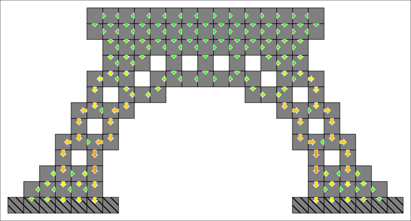

<!-- -8<- [start:intro] -->
# Gustave: structural integrity library for video games

Gustave is a C++ library providing static [structural analysis](https://en.wikipedia.org/wiki/Structural_analysis) for sandbox construction games. Concretely, Gustave analyses how a player-made structure supports (or not) its own weight.
<!-- -8<- [end:intro] -->

<!-- -8<- [start:body] -->
This library has the double goal of being fun and educational:

- **Fun:** many games (city-builders, factory simulation, space/flight simulator, bridge builders, ...) base their core gameplay loop on finding solutions to complex realistic problems. A few construction games have already successfully implemented such loops using structural integrity.
- **Educational:** Gustave certainly doesn't replace a civil engineering degree, but is made in the hope that it will teach a few notions in physics, strength of materials, or architecture.

To do so, Gustave uses a more realistic model than commonly used in the gaming industry. It is simply based on Newton's first law of motion: a block stays at rest only if the sum of forces exerted on it is zero. This library finds a force distribution that satisfies Newton's equations. These forces causes compression/shear/tensile stresses on each block. Each block has its own maximum nominal stress: if they are exceeded, the structure is not stable.

## Key features

- **Compression/shear/tensile model**: this offer both a touch of realism and interesting game design opportunities (the right material for the right situation).
- **Optimized force distributions**: Gustave tends to spread loads across multiple supports when possible, and prefers transferring force through stronger blocks.
- **Horizontal/hanging construction support**: it is possible to check the stability of a structure built on the side of a cliff, or from the ceiling of a cave. Gustave is not limited to building vertically from the ground
- **3D physics**
- **Multi-level API**:
    - **World (cube grid only)**: just insert/remove blocks in a world. Gustave will automatically group them into independent structures, compute force distributions, and evaluate stresses.
    - **Solver (any block shape/position)**: Gustave generates a force distribution and stresses for a given structure.
- **Compile-time dimensional analysis (optional)**: Gustave uses C++ metaprogramming to enforce dimensional correctness at the API level and in its implementation. Adding a position vector with a force vector, or assigning a mass to a length, will generate compiler errors.
- **Highly customizable library**: template parameters allows to use float/double, another 3d-vector implementation, or another unit/dimension library.
- **Performance & scale**: Gustave is currently able to evaluate a structure of 8,000 blocks in less than a second on a PC from 2012. This should already be sufficient for some video games, and there is still a lot of room for optimisation in future releases.

## What Gustave isn't

- **NO real-time simulation of failing structures**: Gustave only perform static analysis. If you want a building collapsing in real time, use a conventional physics engine with rigid bodies.
- **NO real life engineering**: Gustave's model is absolutely not realistic enough to be used in actual civil engineering.

## Requirements

Gustave is a **header-only** library that just requires a **C++20** compiler and standard library. The currently tested platforms are:

- **gcc 13.1** (Linux, libstdc++)
- **clang 17.0** (Linux, libc++)
- **MSVC 19.39.33522** (Windows, Microsoft STL) (Visual Studio 2022)

<!-- -8<- [end:body] -->

## User guide

- [Overview](./docs/overview.md)
- [Install](./docs/install.md)
- [Tutorials](./docs/tutorials/tutorials.md)
- [Lexicon](./docs/lexicon.md)

## Future work

Gustave's next milestone is to enhance the high-level **World** API by lifting current restrictions on blocks:
- Support block rotation & floating-point positions.
- Support blocks with any convex shape (not only cuboid).
