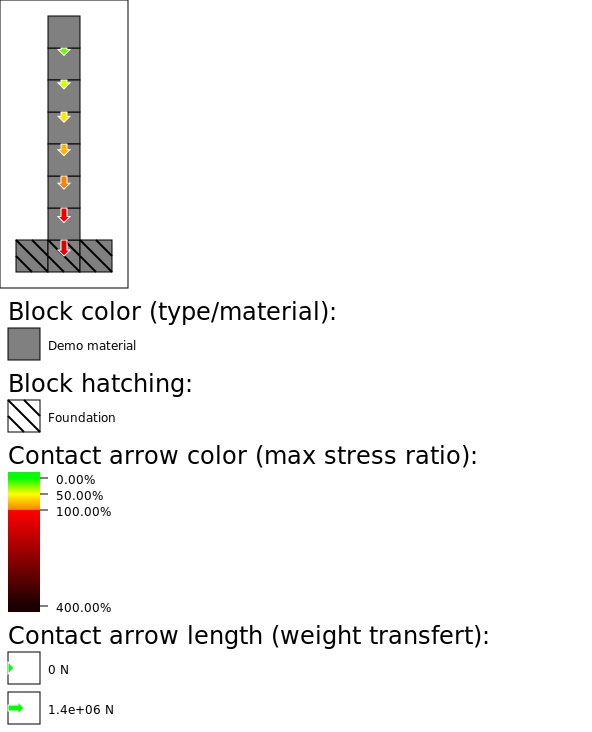

# Gustave Overview

This section will illustrate with concrete examples this library's key features: how it [distributes forces](lexicon.md#force-distribution) inside a [structure](lexicon.md#structure), and how it evaluates [block](lexicon.md#block) stresses (and failing structures).

A structure can have multiple valid [force distributions](lexicon.md#force-distribution). Gustave generates a distribution that is a compromise between multiple criteria:

- runtime performance
- minimizing block stress, and avoiding failing structures
- automatic load balancing between supports
- being intuitive to play with
- enabling interesting problem

All images in this section are generated with an internal tool also available in the repository. All images are in the SVG format: they can be **zoomed-in** as much as necessary.

## Index

- [Simple tower (how to read the images)](#simple-tower)
- [Thicker base, higher tower](#thicker-base)
- [Block strength: bridges](#block-strength-bridges)
- [Block strength: columns](#block-strength-columns)
- [Block mass: columns](#block-mass-columns)
- [Scalability: Eiffel tower (300 blocks)](#scalability-eiffel-tower)
- [Scalability: DNA Helix (8500 blocks)](#scalability-dna-helix)

---

## Simple tower (how to read the images)

The first example is a simple tower: a 1-wide column of blocks. Here there is only a single correct [force distributions](lexicon.md#force-distribution):

- the 1st block **from the top** transferts its weight to the 2nd block.
- the 2nd block from the top transferts the weight of the 1st and 2nd block to the 3rd block.
- ...

Gustave's visualisation tool provides mainly two ways to display forces/stresses. You're free to use similar visualisations for your project, or to implement your own.

### Contact stress

In this image:

- block color represents the [block](lexicon.md#block) "type". It can represent a specific combinaison of material (steel, wood, concrete), mass, layout within the block (full, tube, truss)...
- contact arrows:
  - the length represents the amount of force transferred. As the legend shows, it is measured in Newton. Gustave tries to use real physics units when relevant.
  - the color represents the stress ratio: the ratio between the force transferred and the maximum force allowed by the blocks. Between green and orange, the force/stress is within the block's specifications. Between red and black, one block is failing.

---

### Block heat

In this image, the block color represents its stress ratio: the maximum stress ratio of all its links/contacts. Colors from green to orange means the block is subjected to stresses it can withstand. Red to black means that the block is failing.

---

## Thicker base, higher tower

This example shows that with Gustave's load balancing, it is possible to reach a higher height (or bridge a longer span) by making a pillar thicker at the base. Using a lighter or stronger material is not the only solution !

This also illustrates that fixing a structure in Gustave can be made extremely beginner friendly: just use a simple color code to display which blocks are failing (example: red). A structure can usually be fixed by reinforcing the structure around the red blocks/contacts. No need to know what a Newton is.

---

## Block strength: bridges

This example shows how using materials with different compressive/shear/tensile strengths impacts how Gustave transferts weight in a bridge:

- Bridge 1: high compression strength blocks only. These blocks are good at transferring weight downwards, so Gustave transferts most of the bridge's weight to the pillars.
- Bridge 2: high shear strength blocks only. In Gustave, these blocks are good at transferring weight horizontally (a huge oversimplification from reality), so the library transferts most of the bridge's weight through the deck to the abutments.
- Bridge 3: high compression strength for pillars, high shear strength for the deck. It has no block nearing failure (orange color), contrary to the 2 other bridges.

With the compression/shear/tensile model, whether a material is better than another is situational. The right material for the right problem can become a central game mechanic with Gustave.

---

## Block strength: columns

First, this example shows that Gustave can transfert weight to higher blocks. Concretely, it is possible to build structures hanging from a surface of foundations (example: a cave ceiling).

Second, it demonstrates how changing compression/shear/tensile strength of blocks influences a structure's force repartition. Each column can transfert its weight either to the floor or the ceiling.

- Left column (high compression strength): most weight is transferred to the ground
- Middle column (compression = tensile): the weight is equally split between the ceiling and the ground
- Right column (high tensile strength): most weight is transferred to the ceiling

This repartition is a better solution than always evenly splitting between the floor and the ceiling: it reduces the overall stress of the blocks. It is not optimal: it would have been possible in this example to have no failing blocks by transferring forces differently.

---

## Block mass: columns

This example mixes blocks with different mass and strength in order to build the higher columns. Two block types are available: heavy and light. A light block has half weight of a heavy block, and half its strength.

The result shouldn't be surprising: a column built with a strong material at the base, and a light material at the top, can reach a higher height without failing.

---

## Scalability: Eiffel tower (300 blocks)

This example was the library's first benchmark, with more than 300 blocks and 450 links. It can now be generated nearly instantly (<20ms) on all tested compiler & standard libraries.

---

## Scalability: DNA Helix (8500 blocks)

This example is the library's current benchmark, containing more than 8500 blocks and 15800 links. It was generated in less than 1 second on an Intel i5 3570k (from 2012) using gcc 13. This time includes parsing the input blocks as JSON and writing the output SVG file.

Here the structure is a giant DNA helix made of concrete, where the foundations are on the left side. This extremely weird balcony has been chosen because it is in theory a bad scenario for Gustave's performance.

About the results: concrete has a much higher compression strength than tensile strength. The structure has to transfert the weight from right to left.
- The bottom-right to top-left diagonals are subjected to **tension** & shear stress: they fail early.
- The top-right to bottom-left diagonals are subjected to **compression** & shear stress: they transfert more force without failing.

---

