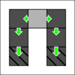

# 2. Solver API

This section will describe Gustave's low-level API: [Solvers](../../lexicon.md#solver).

In this tutorial we'll aim at creating the following structure, and computing its force distribution:



!!! note
    In this tutorial, all quantities are interpreted in the metric system. This is not mandatory when using the `unitless` distribution. You can interpret them in another natural system of unit: if you choose to interpret 1 unit of length as an imperial `foot`, 1 unit of mass as an imperial `pound`, and 1 unit of time as a `second`, then 1 unit of force must be interpreted as a `pound.foot/second²`.

## Choosing a distribution

First, let's choose the `std::unitless` distribution with `double` precision, as explained in [getting started](../01-getting-started/index.md):

```c++
--8<-- "docs/tutorials/02-solver-api/main.cpp:distrib-unitless"
```

We'll also define some convenient type aliases:

```c++
--8<-- "docs/tutorials/02-solver-api/main.cpp:type-aliases"
```

## Create a new solver structure

To create an empty `Structure`, just use its default constructor. We'll store ours in a [std::shared_ptr](https://en.cppreference.com/w/cpp/memory/shared_ptr), as it will be required later by the [solver](../../lexicon.md#solver).

```c++
--8<-- "docs/tutorials/02-solver-api/main.cpp:new-structure"
```

Expected output:

```
--8<-- "generated-snippets/tuto-02.txt:new-structure"
```

## Add blocks to a structure

Use `Structure::addNode(...)`. This takes a `Structure::Node` object, whose constructor has 2 arguments:

- **mass:** the mass of the block (in kilogram)
- **isFoundation:** a boolean to indicate if this block is a [foundation](../../lexicon.md#block)

It returns a `NodeIndex`, a unique identifier of this block in the structure. These indices are generated sequentially (0,1,2,...).

```c++
--8<-- "docs/tutorials/02-solver-api/main.cpp:add-blocks"
```

Expected output:

```
--8<-- "generated-snippets/tuto-02.txt:add-blocks"
```

## Add links to a structure

Use `Structure::addLink(...)`. This takes a `Structure::Link` object, whose constructor has 4 arguments:

- **localNodeId:** the index of the first node
- **otherNodeId:** the index of the second node
- **normal:** the normal vector on the surface of **localNode**
- **conductivity:** a compression/shear/tensile quantity in `Newton/metre`. This is used by the [solver](../../lexicon.md#solver) to compute a [force distribution](../../lexicon.md#force-distribution): the higher the 3 components are, the more force will be transmitted through this link. It should be proportional to the maximum nominal force/pressure of the contact surface, and inversely proportional to the distance between the 2 nodes.

It sequentially returns a `LinkIndex`, which uniquely identifies this link in the structure.

```c++
--8<-- "docs/tutorials/02-solver-api/main.cpp:add-links"
```

Here we stored 2 link indices for later use: `l00_01` (between foundation `n00` and block `n01`) and `l20_21` (between foundation `n20` and block `n21`).

Expected output:

```
--8<-- "generated-snippets/tuto-02.txt:add-links"
```

**Note:** It is possible to mix calls to `Structure::addLink()` and `Structure::addNode()`. The only requirement is that when `addLink()` is called, the nodes in the new link are already declared.

## Configure a solver

For now the only [solver](../../lexicon.md#solver) available is the `F1Solver`, which generate force vectors that are always colinear with the gravity acceleration vector `g`.

The two mandatory parameters for the solver are:

- **g:** the gravity acceleration vector in `metre/second²`
- **solverPrecision:** the precision of the solver. The closer to 0 it is, the more accurate the solutions will be according to Newton's 1st law of motion (the net force of non-foundation blocks will be closer to 0).

```c++
--8<-- "docs/tutorials/02-solver-api/main.cpp:newSolver"
```

```c++
--8<-- "docs/tutorials/02-solver-api/main.cpp:configure-solver"
```

Expected output:

```
--8<-- "generated-snippets/tuto-02.txt:configure-solver"
```

## Solve a structure

Simply use `F1Solver::run(structure)`. This returns a `SolverResult` object with a `isSolved()` method, indicating if a solution within the target `solverPrecision` was reached.

```c++
--8<-- "docs/tutorials/02-solver-api/main.cpp:solve-structure"
```

Expected output:

```
--8<-- "generated-snippets/tuto-02.txt:solve-structure"
```

!!! warning
    Do not modify `structure` after passing it to the solver.

## Inspect a solution's force vectors

If a `SolverResult` object is solved, the `solution()` method returns a `Solution` object. This object provides convenient methods to inspect nodes, contacts, and forces.

```c++
--8<-- "docs/tutorials/02-solver-api/main.cpp:inspect-solution"
```

A few comments on this block of code:

- `solution.contacts()` returns a range to access any link/contact through a `ContactReference`
- `.at({l00_01, true})` gets us the contact from its `ContactIndex`. This contact index is made from the link index `l00_01`, and a `true` boolean indicating that we want the contact on the surface of `localNodeId`, so `n00` in this case
- `.forceVector()` gets the force vector acting on the surface of `n00` from `n01`, transmitted through link `l00_01`

Possible output:

```
--8<-- "generated-snippets/tuto-02.txt:inspect-solution"
```

Comments about this output:

- **line 1**: This is the force of contact index `{l00_01, true}`, so the force on the foundation `n00` from `n01`. Since the structure is symmetrical, we expect this force to be half the total weight of the structure. Total weight of the structure: `5 * blockMass * g = {0, -150'000, 0} Newton`
- **line 2**: This is the force of contact index `{l20_21, false}`. The `false` inverses the `localNodeId` and `otherNodeId` of the contact: so this is the force on `n21` by the foundation `n20`. The foundation prevents `n21` from falling by pushing in the opposite direction of the gravity vector `g`. So the Y coordinate is positive.
