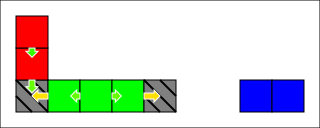

# Tutorial: World blocks

This sections explains how to inspect [structures](../../../lexicon.md#structure) in a `SyncWorld`.

Structures are automatically created/deleted by the `SyncWorld` when it is modified, so users can't directly edit structures. They can be inspected by getting a `StructureReference` object.

## Index

1. [Prerequisites](#prerequisites)
1. [List all structures and their blocks](#list-all-structures-and-their-blocks)
1. [List all structures of a block](#list-all-structures-of-a-block)
1. [Structure status: valid and solved](#structure-status-valid-and-solved)

## Prerequisites

- [Selecting a Gustave configuration](../../01-getting-started/README.md)
- [Creating an empty SyncWorld](../01-creating-world/README.md): we'll reuse the `newWorld()` function.

```c++
auto world = newWorld();
```

- [Adding & inspecting world blocks](../02-world-blocks/README.md): we'll add a few blocks for this tutorial:

```c++
{
    auto tr = World::Transaction{};
    // foundation shared between structure 1 & 2
    tr.addBlock({ { 0,0,0 }, maxBlockStress, foundationMass, true });
    // structure 1
    tr.addBlock({ { 0,1,0 }, maxBlockStress, struct1Mass, false });
    tr.addBlock({ { 0,2,0 }, maxBlockStress, struct1Mass, false });
    // structure 2
    tr.addBlock({ { 1,0,0 }, maxBlockStress, struct2Mass, false });
    tr.addBlock({ { 2,0,0 }, maxBlockStress, struct2Mass, false });
    tr.addBlock({ { 3,0,0 }, maxBlockStress, struct2Mass, false });
    tr.addBlock({ { 4,0,0 }, maxBlockStress, struct2Mass, true });
    // structure 3 (no foundations)
    tr.addBlock({ { 7,0,0 }, maxBlockStress, struct3Mass, false });
    tr.addBlock({ { 8,0,0 }, maxBlockStress, struct3Mass, false });

    world.modify(tr);
}
```

Here's a visual representation of this world:



## List all structures and their blocks

`world.structures()` is a [forward range](https://en.cppreference.com/w/cpp/ranges/forward_range) of `StructureReference`. You can iterate over it using a [range-based for loop](https://en.cppreference.com/w/cpp/language/range-for). Then a `StructureReference` has a `.blocks()` method, which works like `world.blocks()`, and is a range of `BlockReference` objects.

So iterating over all structures and listing their blocks is a simple double loop:

```c++
std::cout << "List of structures (size = " << world.structures().size() << ")\n";
for (auto const& structure : world.structures()) {
    std::cout << "- structure of " << structure.blocks().size() << " blocks:\n";
    for (auto const& block : structure.blocks()) {
        std::cout << "  - " << block.index() << '\n';
    }
}
```

Possible output:

```
List of structures (size = 3)
- structure of 2 blocks:
  - { "x": 8, "y": 0, "z": 0}
  - { "x": 7, "y": 0, "z": 0}
- structure of 5 blocks:
  - { "x": 4, "y": 0, "z": 0}
  - { "x": 3, "y": 0, "z": 0}
  - { "x": 2, "y": 0, "z": 0}
  - { "x": 0, "y": 0, "z": 0}
  - { "x": 1, "y": 0, "z": 0}
- structure of 3 blocks:
  - { "x": 0, "y": 2, "z": 0}
  - { "x": 0, "y": 0, "z": 0}
  - { "x": 0, "y": 1, "z": 0}
```

Both `world.structures()` and `structure.blocks()` are unordered containers, so all structures and blocks are given in no particular order.

In the above output:

- The `2 blocks` structure is the blue one on the right.
- The `5 blocks` structure is the green one, and includes the 2 foundations
- The `3 blocks` structure is the red one on the left, and includes the bottom-left foundation.

## List all structures of a block

A `BlockReference` has a `.structures()` method returning a range of `StructureReference`, similar to `world.structures()`:

```c++
auto listStructuresOfBlock = [&world](World::BlockIndex const& blockId) -> void {
    auto const blockRef = world.blocks().at(blockId);
    std::cout << "Structures of block " << blockId << " (size = " << blockRef.structures().size() << "):\n";
    for (auto const& structureRef : blockRef.structures()) {
        std::cout << "- structure of " << structureRef.blocks().size() << " blocks\n";
    }
};
listStructuresOfBlock({ 0,0,0 });
listStructuresOfBlock({ 7,0,0 });
```

Expected output:

```
Structures of block { "x": 0, "y": 0, "z": 0} (size = 2):
- structure of 5 blocks
- structure of 3 blocks
Structures of block { "x": 7, "y": 0, "z": 0} (size = 1):
- structure of 2 blocks
```

**Note:** a non-foundation block always has exactly 1 structure. A foundation block can have 0 to 6 structures in a cuboid world.

## Structure status: valid and solved

A `StructureReference` has two important methods about its status:

- `isValid()`: checks if the structure still exists in the world. If `false`, all other operations on this reference will throw. This can happen if a `world.modify()` call deleted the structure.
- `isSolved()`: checks if the solver was able to find a solution. It `false`, it is possible get the list of blocks, [links and contacts](../../../lexicon.md#links-and-contacts) of this structure, but reading forces and stresses will throw. This can happen if a structure has no foundation (or the solver didn't converge).

Running this test code:

```c++
auto printStructureStatusOfBlock = [&world](World::BlockIndex const& blockId) -> void {
    auto const structureRef = world.blocks().at(blockId).structures()[0];
    std::cout << "Statut of structure of block " << blockId << ": ";
    if (structureRef.isValid()) {
        if (structureRef.isSolved()) {
            std::cout << "solved\n";
        } else {
            std::cout << "not solved\n";
        }
    } else {
        std::cout << "invalid\n";
    }
};
printStructureStatusOfBlock({ 0,1,0 });
printStructureStatusOfBlock({ 7,0,0 });
```

Should give the following output:

```
Statut of structure of block { "x": 0, "y": 1, "z": 0}: solved
Statut of structure of block { "x": 7, "y": 0, "z": 0}: not solved
```
