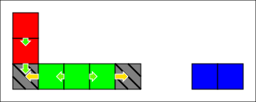

# 3.3. Structures

This sections explains how to inspect [structures](../../../lexicon.md#structure) in a `SyncWorld`.

Structures are automatically created/deleted by the `SyncWorld` when it is modified, so users can't directly edit structures. They can be inspected by getting a `StructureReference` object.

For a given `SyncWorld`, all structures have a unique auto-generated index. An index is never reused by a `SyncWorld`.

## Prerequisites

- [Selecting a Gustave configuration](../../01-getting-started/index.md)
- [Creating an empty World](../01-creating-world/index.md): we'll reuse the [`newWorld()`](../01-creating-world/index.md#configuring-a-world) function.

```c++
--8<-- "docs/tutorials/03-world-api/03-world-structures/main.cpp:create-world"
```

- [Adding & inspecting world blocks](../02-world-blocks/index.md): we'll add a few blocks for this tutorial:

```c++
--8<-- "docs/tutorials/03-world-api/03-world-structures/main.cpp:add-blocks"
```

Here's a visual representation of this world:



## Transaction: list the indices of modified structures

Note that in the previous code block, the result of the transaction was stored in a `trResult` variable. This `TransactionResult` objects holds 2 containers:

- The indices of the new structures
- The indices of the deleted structures

The transaction's result contains exactly all the modified structures of a transaction. If a structure isn't in any of these 2 containers, it has not been changed.

```c++
--8<-- "docs/tutorials/03-world-api/03-world-structures/main.cpp:transaction-result"
```

Possible output:

```
--8<-- "generated-snippets/tuto-03-03.txt:transaction-result"
```

## Get a structure reference by index

`world.structures()` provides 2 methods to get a `StructureReference` by index:

- `.at(index)`: returns a reference if the index is valid, throws otherwise.
- `.find(index)`: always returns a reference, which must be tested for validity before usage.

```c++
--8<-- "docs/tutorials/03-world-api/03-world-structures/main.cpp:structure-by-id"
```

Possible output:

```
--8<-- "generated-snippets/tuto-03-03.txt:structure-by-id"
```

## List all structures and their blocks

`world.structures()` is a [forward range](https://en.cppreference.com/w/cpp/ranges/forward_range) of `StructureReference`. They can be iterated over using a [range-based for loop](https://en.cppreference.com/w/cpp/language/range-for). Then a `StructureReference` has a `.blocks()` method, which works like `world.blocks()`, and is a range of `BlockReference` objects.

So iterating over all structures and listing their blocks is a simple double loop:

```c++
--8<-- "docs/tutorials/03-world-api/03-world-structures/main.cpp:list-world-structures"
```

!!! note
    Both `world.structures()` and `structure.blocks()` are unordered containers, so all structures and blocks are given in no particular order.

Possible output:

```
--8<-- "generated-snippets/tuto-03-03.txt:list-world-structures"
```

In the above output:

- The `2 blocks` structure is the blue one on the right.
- The `5 blocks` structure is the green one, and includes the 2 foundations
- The `3 blocks` structure is the red one on the left, and includes the bottom-left foundation.

## List all structures of a block

A `BlockReference` has a `.structures()` method returning a range of `StructureReference`, similar to `world.structures()`:

```c++
--8<-- "docs/tutorials/03-world-api/03-world-structures/main.cpp:list-block-structures"
```

Expected output:

```
--8<-- "generated-snippets/tuto-03-03.txt:list-block-structures"
```

!!! note
    A non-foundation block always has exactly 1 structure. A foundation block can have 0 to 6 structures in a cuboid world.

## Block: unique structure

If a `block` belongs to a unique structure, this structure can be obtained using `block.structures().unique()`. This is primarily intended for non-foundation blocks which always belong to a single structure. This can also be used on foundations, however it will throw if the block doesn't belong to exactly one structure.

```c++
--8<-- "docs/tutorials/03-world-api/03-world-structures/main.cpp:block-unique-structure"
```

Possible output:

```
--8<-- "generated-snippets/tuto-03-03.txt:block-unique-structure"
```

## Structure status: valid and solved

A `StructureReference` has two important methods about its status:

- `isValid()`: checks if the structure still exists in the world. If `false`, all other operations on this reference will throw. This can happen if a `world.modify()` call deleted the structure.
- `isSolved()`: checks if the solver was able to find a solution. It `false`, it is possible get the list of blocks, [links and contacts](../../../lexicon.md#links-and-contacts) of this structure, but reading forces and stresses will throw. This can happen if a structure has no foundation (or the solver didn't converge).

Running this test code:

```c++
--8<-- "docs/tutorials/03-world-api/03-world-structures/main.cpp:structure-status"
```

Should give the following output:

```
--8<-- "generated-snippets/tuto-03-03.txt:structure-status"
```
