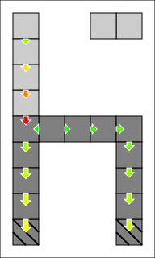

# 3.4. Links, forces and stresses

This section explains how to inspect [links and contacts](../../../lexicon.md#links-and-contacts) in a `SyncWorld`.

In a world, links and contacts have a force and a stress factor computed by the [solver](../../../lexicon.md#solver). They can be used to determine which [blocks](../../../lexicon.md#block) or [structures](../../../lexicon.md#structure) are stable (or failing).

As links and contacts are quite similar, they are both manipulated with the same type: `ContactReference`.

## Prerequisites

- [Selecting a Gustave configuration](../../01-getting-started/index.md)
- [Creating an empty World](../01-creating-world/index.md): we'll reuse the [`newWorld()`](../01-creating-world/index.md#configuring-a-world) function.

```c++
auto world = newWorld();
```

- [Adding & inspecting world blocks](../02-world-blocks/index.md): we'll add a few blocks for this tutorial.

We'll prepopulate the world with "A chair and a floating platform":

```c++
// { compression, shear, tensile } in pascal
auto const strongBlockStress = G::Model::PressureStress{ 500'000.0, 500'000.0, 500'000.0 };
auto const weakBlockStress = G::Model::PressureStress{ 100'000.0, 100'000.0, 100'000.0 };

// kilogram
auto const mass = 3'000.0;
{
    auto tr = World::Transaction{};
    // The chair
    tr.addBlock({ { 0,8,0 }, weakBlockStress, mass, false });
    tr.addBlock({ { 0,7,0 }, weakBlockStress, mass, false });
    tr.addBlock({ { 0,6,0 }, weakBlockStress, mass, false });
    tr.addBlock({ { 0,5,0 }, weakBlockStress, mass, false });
    tr.addBlock({ { 0,4,0 }, strongBlockStress, mass, false });
    tr.addBlock({ { 0,3,0 }, strongBlockStress, mass, false });
    tr.addBlock({ { 0,2,0 }, strongBlockStress, mass, false });
    tr.addBlock({ { 0,1,0 }, strongBlockStress, mass, false });
    tr.addBlock({ { 0,0,0 }, strongBlockStress, mass, true });

    tr.addBlock({ { 1,4,0 }, strongBlockStress, mass, false });
    tr.addBlock({ { 2,4,0 }, strongBlockStress, mass, false });
    tr.addBlock({ { 3,4,0 }, strongBlockStress, mass, false });

    tr.addBlock({ { 4,4,0 }, strongBlockStress, mass, false });
    tr.addBlock({ { 4,3,0 }, strongBlockStress, mass, false });
    tr.addBlock({ { 4,2,0 }, strongBlockStress, mass, false });
    tr.addBlock({ { 4,1,0 }, strongBlockStress, mass, false });
    tr.addBlock({ { 4,0,0 }, strongBlockStress, mass, true });

    // Floating blocks
    tr.addBlock({ { 3,8,0 }, weakBlockStress, mass, false });
    tr.addBlock({ { 4,8,0 }, weakBlockStress, mass, false });

    world.modify(tr);
}
```

Here's a visual representation of this world:



Finally, a convenient alias to the `Direction` type, which holds an axis-aligned direction (plusX, minusX, plusY, ...):

```
using Direction = World::ContactIndex::Direction;
```

## Inspect a specific contact

To get a specific `ContactReference`, use the method `world.contacts().at(...)`. The parameter is a `ContactIndex`, made of:

- the `BlockIndex` of the block owning the contact surface.
- a `Direction`, getting a single surface of this block.

```c++
{
    auto const contactRef = world.contacts().at({ {0,4,0}, Direction::plusY() });
    std::cout << "Contact " << contactRef.index() << ": other block is " << contactRef.otherBlock().index() << '\n';
}
```

Expected output:

```
Contact { "blockIndex": { "x": 0, "y": 4, "z": 0}, "direction": "plusY" }: other block is { "x": 0, "y": 5, "z": 0}
```

## Check a contact's status

Like structures, a `ContactReference` has 2 important methods to check its status.

- `isValid()` checks if the contact exists. If false, almost all operations on this reference will throw.
- `isSolved()` checks if the [solver](../../../lexicon.md#solver) was able to find a [force distribution](../../../lexicon.md#force-distribution) for the structure owning this contact. If false, some operations will throw (reading force, pressure or stress). It implies `isValid()`.

```c++
{
    auto printContactStatus = [&world](World::ContactIndex const& contactId) -> void {
        auto const contactRef = world.contacts().find(contactId);
        std::cout << "Contact " << contactId << ": ";
        if (contactRef.isValid()) {
            if (contactRef.isSolved()) {
                std::cout << "solved\n";
            } else {
                std::cout << "unsolved\n";
            }
        } else {
            std::cout << "invalid\n";
        }
    };
    printContactStatus({ {0,4,0}, Direction::plusY() });
    printContactStatus({ {3,8,0}, Direction::plusX() });
    printContactStatus({ {9,9,0}, Direction::minusX() });
}
```

Expected output:

```
Contact { "blockIndex": { "x": 0, "y": 4, "z": 0}, "direction": "plusY" }: solved
Contact { "blockIndex": { "x": 3, "y": 8, "z": 0}, "direction": "plusX" }: unsolved
Contact { "blockIndex": { "x": 9, "y": 9, "z": 0}, "direction": "minusX" }: invalid
```

## Contact's force

For a solved `ContactReference`, the `forceVector()` method is available. It returns the force exerced by `otherBlock()` on `localBlock()` through this link:

```c++
{
    auto printContactForce = [&world](World::ContactIndex const& contactId) -> void {
        auto const cRef = world.contacts().at(contactId);
        std::cout << "Force vector by block " << cRef.otherBlock().index() << " on block " << cRef.localBlock().index();
        std::cout << " = " << cRef.forceVector() << '\n';
    };
    printContactForce({ {0,4,0}, Direction::plusY() });
    printContactForce({ {0,1,0}, Direction::minusY() });
    printContactForce({ {4,1,0}, Direction::minusY() });
}
```

Possible output:

```
Force vector by block { "x": 0, "y": 5, "z": 0} on block { "x": 0, "y": 4, "z": 0} = { "x": 0, "y": -120000, "z": 0 }
Force vector by block { "x": 0, "y": 0, "z": 0} on block { "x": 0, "y": 1, "z": 0} = { "x": -0, "y": 244591, "z": -0 }
Force vector by block { "x": 4, "y": 0, "z": 0} on block { "x": 4, "y": 1, "z": 0} = { "x": -0, "y": 205409, "z": -0 }
```

A few comment on this output:

- **Line 1:** According to Newton's 1st law of motion, this contact must receive the full weight of the 4 blocks making the "back of the chair". The weight vector of 4 blocks is `4 * mass * g = {0, -120'000, 0} Newton`.
- **Line 2 & 3:** These 2 contacts are on the surface of the 2 foundations blocks supporting the whole chair. How Gustave balance the weight between the 2 feet is implementation defined, but the sum of these two forces must be the **opposite**  of the weight vector of the chair. Chair's weight vector: `15 * mass * g = {0, -450'000, 0} Newton`

!!! note
    The [solver](../../../lexicon.md#solver) doesn't always find an exact solution (regarding Newton's 1st law). Remember the `solverPrecision` value from [Tutorial: Creating an empty SyncWorld](../01-creating-world/index.md) ? This is where it matters: here the solver is allowed a `0.01` (1%) error factor. So the Y-value in **line 1** could be between `-118'800` and `-121'200` Newton.

## Link's stress ratio

This is the ratio `actual_pressure / max_nominal_pressure`, expressed as compression/shear/tensile components. This is an important property to check the link's stability: if all components are below 1, the link is stable. Otherwise, the link is failing.

A solved `ContactReference` has a `stressRatio()` method:

```c++
{
    auto printContactStress = [&world](World::ContactIndex const& contactId) -> void {
        auto const cRef = world.contacts().at(contactId);
        std::cout << "Stress of link " << contactId << " = " << cRef.stressRatio() << '\n';
    };
    printContactStress({ {0,4,0}, Direction::plusY() });
    printContactStress({ {0,1,0}, Direction::minusY() });
    printContactStress({ {4,1,0}, Direction::minusY() });
}
```

Possible output:

```
Stress of link { "blockIndex": { "x": 0, "y": 4, "z": 0}, "direction": "plusY" } = { "compression": 1.2, "shear": 0, "tensile": 0 }
Stress of link { "blockIndex": { "x": 0, "y": 1, "z": 0}, "direction": "minusY" } = { "compression": 0.489183, "shear": 0, "tensile": 0 }
Stress of link { "blockIndex": { "x": 4, "y": 1, "z": 0}, "direction": "minusY" } = { "compression": 0.410817, "shear": 0, "tensile": 0 }
```

So here the 2 feet of the chair are stable, but the link at the base of chair's back is failing.

## Stress ratio of a structure

As a conclusion to the `SyncWorld` tutorial, here is how to safely test the stress ratio of a structure (and therefore its stability):

```c++
{
    auto printMaxStressOfStructure = [&world](World::BlockIndex const& blockId) -> void {
        auto const structRef = world.blocks().at(blockId).structures()[0];
        std::cout << "Max stress ratio of structure of block " << blockId << " = ";
        if (structRef.isSolved()) {
            auto result = G::Model::StressRatio{ 0.0, 0.0, 0.0 };
            for (auto const& linkRef : structRef.links()) {
                result.mergeMax(linkRef.stressRatio());
            }
            std::cout << result << '\n';
        } else {
            std::cout << "unsolved structure\n";
        }
    };
    printMaxStressOfStructure({ 0,1,0 });
    printMaxStressOfStructure({ 3,8,0 });
}
```

The key lines of code:

- `auto const structRef = world.blocks().at(blockId).structures()[0]` gets the `StructureReference` of a block. Remember that non-foundation blocks always have exactly 1 structure.
- `if (structRef.isSolved()) { /* ... */ }` ensures that we can access the forces and stresses of all links in a structure.
- `for (auto const& linkRef : structRef.links()) { /*...*/ }` to iterate on all the links of the structure.

Possible output:

```
Max stress ratio of structure of block { "x": 0, "y": 1, "z": 0} = { "compression": 1.2, "shear": 0.169471, "tensile": 0 }
Max stress ratio of structure of block { "x": 3, "y": 8, "z": 0} = unsolved structure
```

- **Line 1** tells us that the chair is failing due to compression constraints. It is also subjected to some shear constraints that don't cause any failure.
- **Line 2** tells us that the magically floating platform has no solution.

This function is easily adaptable to:

- Get the block with the highest stress ratio (the most likely to break).
- Get a list of blocks with any stress component above 1 (= the list of failing blocks).
